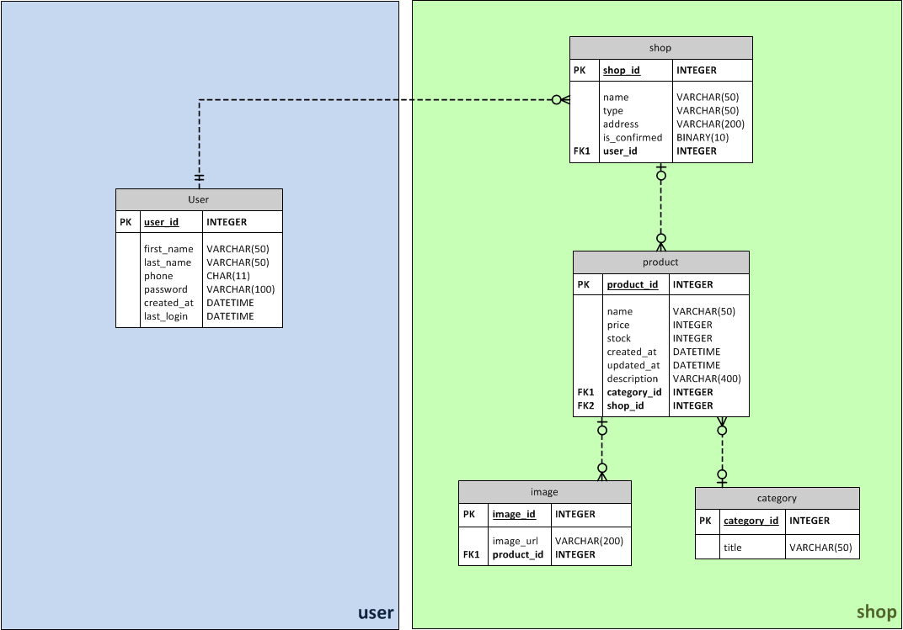

# Insurance Project

This project is about a dashboard that users can create their products and sell them.

**ERD** :
-
In the first step, ERD of the database designed and the apps specified.

## Features
This web application contains:
* User app:
  * JWT authentication
  * Register and login with phone (instead of username)
  * Editable users profile
* Shop app:
  * Anyone can view list of shops
  * Users can create new shops and edit their shops
  * Each user can create more than one shop
  * Only owner of a shop can create products for his/her shop
  * Only owner of a shop can edit products of the shop
  * Only registered users can view products
* Users permissions:
  * Edit their own profile
  * Create shop
  * Edit shop
  * Create product in their own shop
  * Edit product

## Technologies
 * Python
 * Django
 * REST-framework
 * Swagger
 * JWT

### Swagger:

